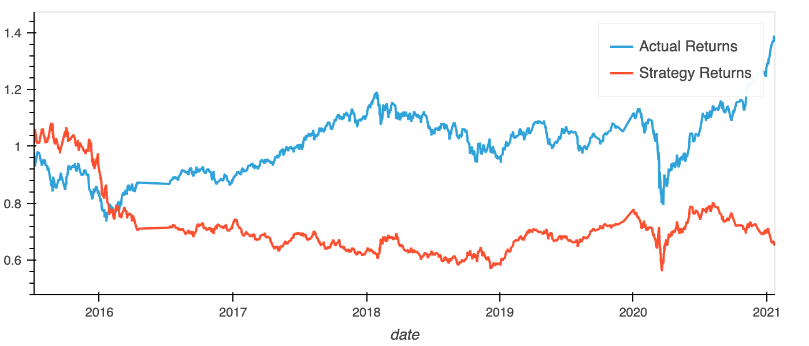
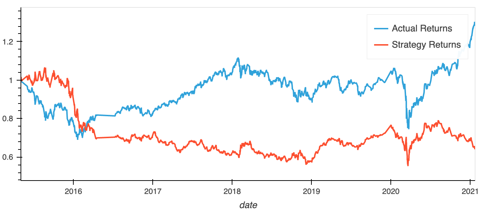
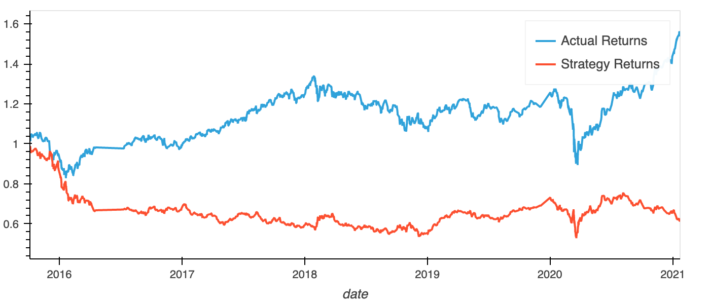
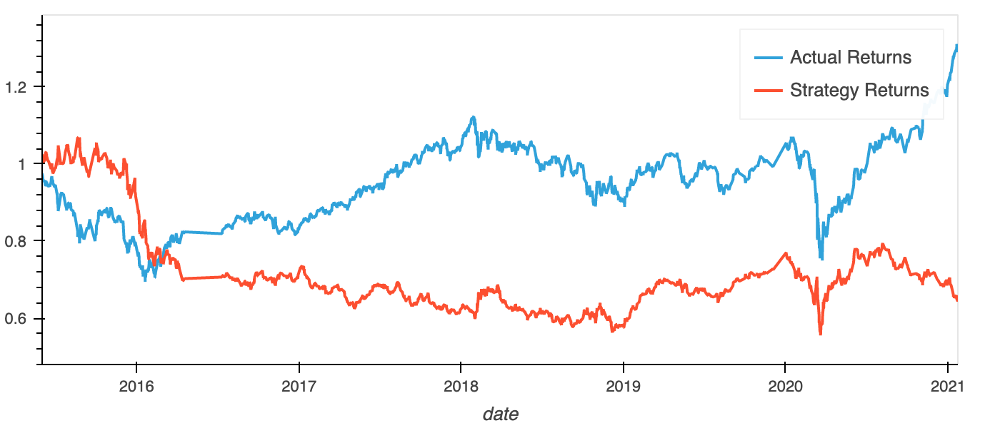
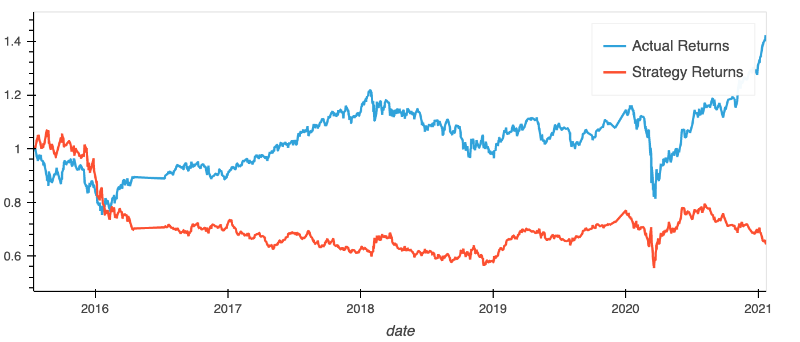
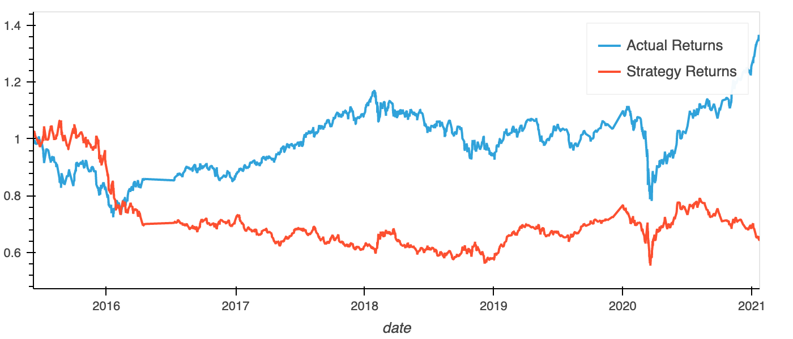

# Module 14 Challenge: Machine Learning Trading Bot
Monash University FinTech Bootcamp

This project involves creating a machine learning model that can accurately predict buy and sell signals from stocks by using a short window of simple moving average(SMA) and long windows. Multiple models have been created with different SMA windows and training data size, in order to tune the baseline model. A new machine learning classifier is then evaluated.

## Original Model
Short SMA window = 4

Long SMA window = 100

Training data size = 3 months

### Classification Report
|              |   precision |    recall |   f1-score |     support |
|:-------------|------------:|----------:|-----------:|------------:|
| -1.0         |    0.428571 | 0.0382483 |   0.070229 | 1804        |
| 1.0          |    0.558636 | 0.95979   |   0.706223 | 2288        |
| accuracy     |    0.553519 | 0.553519  |   0.553519 |    0.553519 |
| macro avg    |    0.493604 | 0.499019  |   0.388226 | 4092        |
| weighted avg |    0.501296 | 0.553519  |   0.425838 | 4092        |

### Cumalative Returns Plot

## Smaller Training Data Model
Short SMA window = 4

Long SMA window = 100

Training data size = 1 month

### Classification Report
|              |   precision |    recall |   f1-score |     support |
|:-------------|------------:|----------:|-----------:|------------:|
| -1.0         |    0.374233 | 0.0333698 |  0.0612757 | 1828        |
| 1.0          |    0.557032 | 0.95611   |  0.703944  | 2324        |
| accuracy     |    0.549855 | 0.549855  |  0.549855  |    0.549855 |
| macro avg    |    0.465632 | 0.49474   |  0.38261   | 4152        |
| weighted avg |    0.476551 | 0.549855  |  0.420997  | 4152        |

### Cumalative Returns Plot

## Larger Training Data Model
Short SMA window = 4

Long SMA window = 100

Training data size = 6 months

### Classification Report
|              |   precision |   recall |   f1-score |     support |
|:-------------|------------:|---------:|-----------:|------------:|
| -1.0         |    0.44186  | 0.02194  |  0.0418042 | 1732        |
| 1.0          |    0.560799 | 0.97829  |  0.71292   | 2211        |
| accuracy     |    0.558204 | 0.558204 |  0.558204  |    0.558204 |
| macro avg    |    0.50133  | 0.500115 |  0.377362  | 3943        |
| weighted avg |    0.508554 | 0.558204 |  0.418126  | 3943        |

### Cumalative Returns Plot

## Shorter Long SMA Model
Short SMA window = 4

Long SMA window = 50

Training data size = 3 months

### Classification Report
|              |   precision |   recall |   f1-score |     support |
|:-------------|------------:|---------:|-----------:|------------:|
| -1.0         |    0.419414 | 0.125411 |   0.193086 | 1826        |
| 1.0          |    0.556512 | 0.863421 |   0.676798 | 2321        |
| accuracy     |    0.538462 | 0.538462 |   0.538462 |    0.538462 |
| macro avg    |    0.487963 | 0.494416 |   0.434942 | 4147        |
| weighted avg |    0.496145 | 0.538462 |   0.463811 | 4147        |

### Cumalative Returns Plot

## Longer Long SMA Model
Short SMA window = 4

Long SMA window = 150

Training data size = 3 months

### Classification Report
|              |   precision |    recall |   f1-score |     support |
|:-------------|------------:|----------:|-----------:|------------:|
| -1.0         |    0.409639 | 0.0189838 |   0.036286 | 1791        |
| 1.0          |    0.559207 | 0.97849   |   0.711686 | 2278        |
| accuracy     |    0.556156 | 0.556156  |   0.556156 |    0.556156 |
| macro avg    |    0.484423 | 0.498737  |   0.373986 | 4069        |
| weighted avg |    0.493373 | 0.556156  |   0.414404 | 4069        |

### Cumalative Returns Plot

## Optimised Model
Short SMA window = 4

Long SMA window = 30

Training data size = 4 months

### Classification Report
|              |   precision |   recall |   f1-score |     support |
|:-------------|------------:|---------:|-----------:|------------:|
| -1.0         |    0.415673 | 0.133845 |   0.20249  | 1823        |
| 1.0          |    0.555337 | 0.851836 |   0.672349 | 2315        |
| accuracy     |    0.535524 | 0.535524 |   0.535524 |    0.535524 |
| macro avg    |    0.485505 | 0.492841 |   0.437419 | 4138        |
| weighted avg |    0.493808 | 0.535524 |   0.465352 | 4138        |

### Cumalative Returns Plot

### Evaluation
This model was very difficult to improve. It's main weakness was its ability to predict the sell (-1) outcome, with especially bad recall. in this model, I significantly reduced the long SMA window in order to improve this. I also decided to increase the training data by a month to increase the overall accuracy. Still this model does not out perform the actual price.

## Naive Bayes Model

### Classification Report
|              |   precision |   recall |   f1-score |     support |
|:-------------|------------:|---------:|-----------:|------------:|
| -1.0         |    0.43004  | 0.298409 |   0.352332 | 1823        |
| 1.0          |    0.554821 | 0.688553 |   0.614495 | 2315        |
| accuracy     |    0.516675 | 0.516675 |   0.516675 |    0.516675 |
| macro avg    |    0.49243  | 0.493481 |   0.483413 | 4138        |
| weighted avg |    0.499848 | 0.516675 |   0.498999 | 4138        |

### Cumalative Returns Plot

### Evaluation
This model, compared to the original and the optimised ones, trades recall for the buy (1) signal, for the recall for the sell(-1) signal. Overall this model still performed quite poorly.